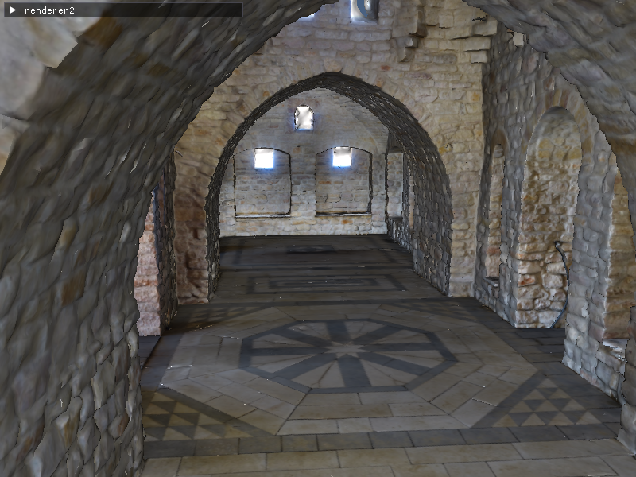
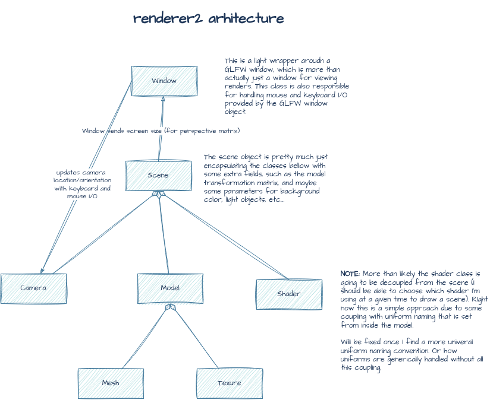

# renderer2

An OpenGL-based renderer built as an evolution of my [previous software renderer](https://github.com/EricHayter/renderer). This version uses modern OpenGL and GPU shaders instead of doing all rendering calculations by hand.

Check out the devlog below for a walkthrough of the renderer in action.

[](https://youtu.be/Bp74YMOqq7I)

## Gallery

<p align="center">
  
</p>

<p align="center">
  
  
</p>

Following [LearnOpenGL](https://learnopengl.com/) and documenting everything I learn in `notes.txt`.

[See my notes](https://erichayter.github.io/renderer2/) on everything I've learned so far.

## Building

Clone with submodules:
```bash
git clone --recursive https://github.com/EricHayter/renderer2
cd renderer2
```

If you already cloned without `--recursive`:
```bash
git submodule update --init --recursive
```

Build:
```bash
mkdir build
cd build
cmake ..
cmake --build .
./src/renderer ../models/plant.obj
```

Once you have everything built, fly around with <kbd>w</kbd> <kbd>a</kbd> <kbd>s</kbd> <kbd>d</kbd> or arrow keys. Hold <kbd>space</kbd> to go up, <kbd>shift</kbd> to go down. Right-click and drag to look around. Hit <kbd>esc</kbd> to exit.

### Supported Model Formats

By default, the renderer supports:
- **OBJ** (`.obj` and `.mtl`) - Wavefront OBJ format with external textures
- **glTF** (`.gltf` and `.glb`) - GL Transmission Format with embedded textures

To enable additional formats (FBX, COLLADA, Blender, STL, etc.), edit `CMakeLists.txt` and uncomment the desired importer. For example, to add FBX support:

```cmake
set(ASSIMP_BUILD_FBX_IMPORTER ON CACHE BOOL "" FORCE)
```

See `CMakeLists.txt` for the full list of available importers. After changing importers, rebuild from scratch:
```bash
cd build
rm -rf *
cmake ..
cmake --build .
```

## Architecture



The renderer is organized into distinct classes handling windowing, rendering, models, and materials. See the diagram above for the relationships between major components.

## Dependencies

This project uses the following third-party libraries:

- **OpenGL 3.3 Core** - Modern graphics API for GPU-accelerated rendering
- **GLFW** - Cross-platform windowing, input handling, and OpenGL context creation
- **glad** - OpenGL function loader generated for OpenGL 3.3 Core Profile
- **GLM** - Header-only mathematics library providing vector and matrix operations matching GLSL
- **Assimp** - Asset import library for loading 3D models (currently: OBJ, glTF/GLB) with material and texture support
- **stb_image** - Single-header image loading library for texture data (PNG, JPG, etc.)
- **ImGui** - Immediate mode GUI library for runtime debugging and parameter tweaking
- **CMake** - Build system for managing compilation across platforms
